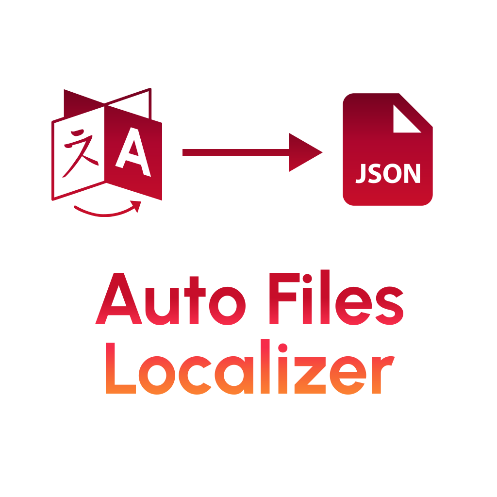

[](https://github.com/Laravel-Phoenix/Auto-Files-Localizer/actions/workflows/php.yml)



# Auto Files Localizer

Laravel Localization package that auto generate json locale files.

## Installation

First install the package using:

```
composer require laravel-phoenix/auto-files-localizer
```

If you need to register the service provider manually at `config/app.php`

```php
'providers' => [
    LaravelPhoenix\AutoFilesLocalizer\AutoTranslationServiceProvider::class,
    // MUST BE ABOVE "TranslationServiceProvider"
    Illuminate\Translation\TranslationServiceProvider::class,
],
```

Check the `.env` file it Should have

```
AUTO_LOCALIZER_ENABLED=true
```

If it doesn't exist please add it manually

## Usage

It will automatically work and generate `.json` files and the localized **requested** words inside them sorted alphabetically.

Note that this package won't work on production for optimization purposes, but if you want to change this setting you should publish the `config/auto-localizer.php` file:

```
php artisan vendor:publish --provider="LaravelPhoenix\AutoFilesLocalizer\AutoTranslationServiceProvider" --tag="config"
```

```php

return [
    'enabled' => env('AUTO_LOCALIZER_ENABLED', false),
    'production' => false, // Turn this to true to work on production
];

```

## License

This package is open-source software released under the [MIT License](LICENSE).
